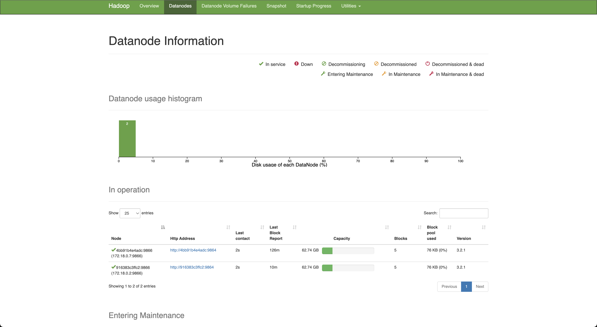

# Hadoop Spark Docker
Running Spark jobs using Docker


## References

- [Docker Hadoop](https://github.com/big-data-europe/docker-hadoop)
- [HDFS Simple Docker Installation Guide for Data Science Workflow](https://towardsdatascience.com/hdfs-simple-docker-installation-guide-for-data-science-workflow-b3ca764fc94b)
- [Set Up Containerize and Test a Single Hadoop Cluster using Docker and Docker compose](https://www.section.io/engineering-education/set-up-containerize-and-test-a-single-hadoop-cluster-using-docker-and-docker-compose/)=
- [Spark Docker](https://github.com/big-data-europe/docker-spark)
- [Hadoop Namenode](https://hub.docker.com/r/bde2020/hadoop-namenode)
- [Apache ZooKeeper](https://zookeeper.apache.org/)
- [Building a real-time big data pipeline (10: Spark Streaming, Kafka, Java)](https://adinasarapu.github.io/posts/2021/01/blog-post-kafka-spark-streaming/)
- [Getting Started with Apache Kafka and Apache Flume (Import data to HDFS](https://towardsdatascience.com/apache-kafka-and-flume-installation-guide-import-data-from-kafka-to-hdfs-c908b0df034c)
- [Kakfa Stack Docker Compose](https://github.com/conduktor/kafka-stack-docker-compose)
- [Complete Kafka Producer with Java](https://www.conduktor.io/kafka/complete-kafka-producer-with-java/)
- [Run a Java Main Method in Maven](https://www.baeldung.com/maven-java-main-method)
- [Apache Kafka : Developing Producer & Consumer in Java](https://www.codeburps.com/post/java-kafka-consumer-producer)
- [Java Kafka Consumer Producer](https://www.codeburps.com/post/java-kafka-consumer-producer)
- [Create a Custom Exception in Java](https://www.baeldung.com/java-new-custom-exception)
- [Getting Started (AVRO)](https://avro.apache.org/docs/1.11.1/getting-started-java/)
- [Hadoop-spark-kafka-zookeeper docker compose](https://davideandreazzini.co.uk/hadoop-spark-kafka-zookeeper-docker-compose/)
- [Docker Kafka Connect image for the Confluent Open Source Platform using Oracle JDK](https://github.com/MihaiBogdanEugen/docker-confluent-kafka-connect/blob/master/README.md)
- [Configuration example for writing data to HDFS](https://docs.cloudera.com/cdp-private-cloud-base/7.1.6/kafka-connect/topics/kafka-connect-connector-hdfs-example.html)

## Software Architecture

|File|Purpose|
|---|---|
|[docker-compose.yml](docker-compose.yml)|Docker compose with the infrastructure required to run the Hadoop cluster.|
|[config/hadoop.env](config/hadoop.env)|Configuration file with the environment variables to use Hadoop.|
|[pom.xml](pom.xml)|Maven project configuration file.|
|[src/com/martincastroalvarez/hadoop//Producer.java](src/com/martincastroalvarez/hadoop/Producer.java)|Java application responsible for sending messages to Kakfa.|
|[src/com/martincastroalvarez/hadoop//Message.java](src/com/martincastroalvarez/hadoop/Message.java)|The Java object that is sent through Kafka.|

## Instructions

### Installation

#### Starting Hadoop
```bash
docker rm -f $(docker ps -a -q)
docker volume rm $(docker volume ls -q)
docker-compose up
```

#### Validating the status of the Hadoop cluster
```bash
docker ps
```
```bash
CONTAINER ID        IMAGE                                                    COMMAND                  CREATED             STATUS                    PORTS                                            NAMES
0f87a832960b        bde2020/hadoop-resourcemanager:2.0.0-hadoop3.2.1-java8   "/entrypoint.sh /r..."   12 hours ago        Up 54 seconds             0.0.0.0:8088->8088/tcp                           yarn
51da2508f5b8        bde2020/hadoop-historyserver:2.0.0-hadoop3.2.1-java8     "/entrypoint.sh /r..."   12 hours ago        Up 55 seconds (healthy)   0.0.0.0:8188->8188/tcp                           historyserver
ec544695c49a        bde2020/hadoop-nodemanager:2.0.0-hadoop3.2.1-java8       "/entrypoint.sh /r..."   12 hours ago        Up 56 seconds (healthy)   0.0.0.0:8042->8042/tcp                           nodemanager
810f87434b2f        bde2020/hadoop-datanode:2.0.0-hadoop3.2.1-java8          "/entrypoint.sh /r..."   12 hours ago        Up 56 seconds (healthy)   0.0.0.0:9864->9864/tcp                           datenode1
ca5186635150        bde2020/hadoop-namenode:2.0.0-hadoop3.2.1-java8          "/entrypoint.sh /r..."   12 hours ago        Up 56 seconds (healthy)   0.0.0.0:9000->9000/tcp, 0.0.0.0:9870->9870/tcp   namenode
beed8502828c        bde2020/hadoop-datanode:2.0.0-hadoop3.2.1-java8          "/entrypoint.sh /r..."   12 hours ago        Up 55 seconds (healthy)   0.0.0.0:9865->9864/tcp                           datenode2
```

### Interacting with HDFS

HDFS, or Hadoop Distributed File System, is a distributed file system designed to store and
process large datasets using commodity hardware. It is part of the Apache Hadoop ecosystem
and is widely used in big data processing. HDFS uses a master-slave architecture with one
NameNode and multiple DataNodes. The NameNode manages the file system metadata, while the
DataNodes store the actual data. This allows for scalable and fault-tolerant data storage
and processing. HDFS is optimized for batch processing and sequential reads, making it
well-suited for applications like log analysis, data warehousing, and machine learning.
However, it is not well suited for random writes and low-latency data access. HDFS is a
critical component of the Hadoop ecosystem and is used by many big data applications.
Its scalable and fault-tolerant design makes it a reliable choice for storing and
processing large datasets. Overall, HDFS plays a crucial role in the world of big
data and is an essential tool for data engineers and analysts.


#### Entering into the Namenode
```bash
docker exec -it namenode /bin/bash
```

#### Listing the content of the root directory
```bash
hdfs dfs -ls /
```
```bash
Found 1 items
drwxr-xr-x   - root supergroup          0 2023-03-03 14:15 /rmstate
```

#### Creating a new directory in HDFS
```bash
hdfs dfs -mkdir -p /user/root
hdfs dfs -ls /
```
```bash
Found 2 items
drwxr-xr-x   - root supergroup          0 2023-03-03 14:15 /rmstate
drwxr-xr-x   - root supergroup          0 2023-03-03 14:17 /user
```

#### Adding a file to HDFS
```bash
echo "lorem" > /tmp/hadoop.txt 
hdfs dfs -put ./input/* input
hdfs dfs -ls /user/
```
```bash
Found 2 items
-rw-r--r--   3 root supergroup          6 2023-03-03 14:20 /user/hadoop.txt
drwxr-xr-x   - root supergroup          0 2023-03-03 14:17 /user/root
```

#### Printing the content of a file in HDFS
```bash
hdfs dfs -cat /user/hadoop.txt 
```
```bash
lorem
```

#### Checking the status of the NameNode at [http://127.0.0.1:9870/dfshealth.html](http://127.0.0.1:9870/dfshealth.html)




### Interacting with Kafka

Kafka is an open-source distributed event streaming platform designed for handling real-time
data feeds. Originally developed by LinkedIn and now part of the Apache Software Foundation,
Kafka is designed for high throughput, low latency, and fault tolerance. At a high level,
Kafka allows producers to write streams of records to a set of topics, which are partitioned
and distributed across a cluster of nodes. Consumers can then read from one or more topics
and process the records in real time. Kafka is horizontally scalable, meaning that it can
handle large volumes of data by adding more nodes to the cluster. Kafka's key features
include distributed architecture, high throughput, low-latency, durability, and scalability.
It is used in a wide variety of use cases, including stream processing, website activity
tracking, log aggregation, real-time analytics, and more. Kafka's popularity has grown
rapidly over the years and has become a standard tool for building real-time data pipelines
in many industries. Overall, Kafka is an essential component of many big data architectures
and plays a crucial role in the world of real-time data processing.


### Using a producer to send messages to Kafka

```bash
clear; mvn compile exec:java -Dexec.mainClass="com.martincastroalvarez.hadoop.Producer" -Dhost="127.0.0.1" -Dport=9092 -Dtopic="my_topic" -Dmessage="lorem ipsum dolor" -Dtitle="Lorem Ipsum"
```
```bash
[...]
111 [com.martincastroalvarez.hadoop.Producer.main()] INFO org.apache.kafka.clients.producer.KafkaProducer  - [Producer clientId=producer-1] Instantiated an idempotent producer.
[...]
403 [com.martincastroalvarez.hadoop.Producer.main()] DEBUG org.apache.kafka.clients.producer.KafkaProducer  - [Producer clientId=producer-1] Kafka producer has been closed
403 [com.martincastroalvarez.hadoop.Producer.main()] INFO com.martincastroalvarez.hadoop.Producer  - Message sent successfuly!
```
